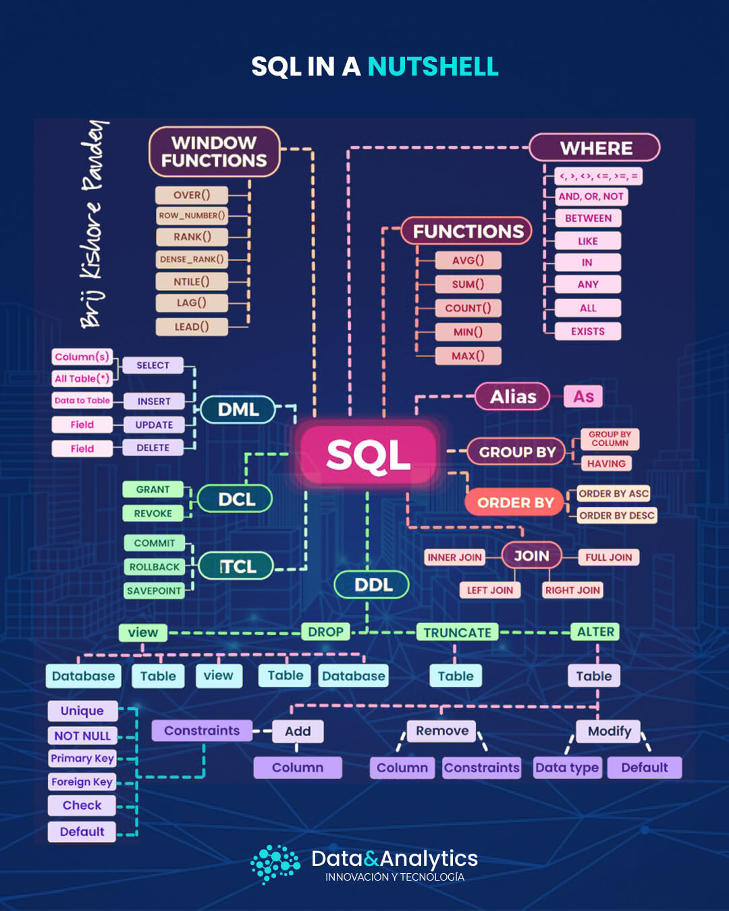

# Base de datos relacional

## Creación de una base de datos relacional

Una base de datos relacional se crea con sentencias SQL y esta tiene una palabras reservadas definidas que permiten la creación, la lectura, la actualización y la eliminación de información.

## Tablas

Dentro de la base de datos se deben crear tablas las cuales están conformadas por filas y columnas

En las filas se encuentra campos donde se puede ingresar y manipular datos. También se les puede dejar vacíos.

Las columnas son creadas cuando se definen los atributos de la tabla con su tipo de dato que puede ser numérico, de caractér unico o una cadena de texto.

Columna A | Columna B | Columna C
----------|-----------|----------
 Dato A1  | Dato B1   | Dato C1
 Dato A2  | 123578    |
 Dato A3  |           | M

## Lenguajes dentro de SQL

El lenguaje SQL se divide en subconjuntos de lenguajes los cuales tienen varias acciones.

- Lenguaje de manipulación de datos (DML)
- Lenguaje de consulta de datos (DQL)
- Lenguaje de definición de datos (DDL)
- Lenguajde de control de datos (DCL)
- Lenguajde de control de transacciones (TCL)


## Consultas o Sentencias de SQL

Además hay palabras reservadas y uso de símbolos en SQL que tiene otras funciones como:
  -  Los *'alias'* para dar un nombre temporal a una tabla o a algún campo de esta.
  -  Los *'group by'* para agrupar por alguna regla.
  -  Los *'order by'* para ordenar por alguna regla como puede ser de numeros del menor a mayor o viceversa o por orden alfabético.
  -  Los *'joins'* que sirve para concatenar información de 2 a más tablas como los 'inner join', 'rigth join', 'left join', y etc.
  -  Los *operadores comparativos* para comparaciones como '<', '>', '=', '<=', '>=', '<>'.
  -  Los *operadores lógicos* como AND, OR, NOT que significan 'conjunción', 'disyunción' y 'negación'.
  -  Los *operadores aritméticos* para realizar operaciones como suma, resta, multiplicación y división.

**A continuación se muestra un mapa mental sobre las consultas o sentencias usadas en SQL:**




## Creación de una base de datos relacional

- Usando las sentencias en SQL se puede crear la base de datos relacional y dentro de ellas las tablas con sus atributos.

### 1. Consulta para crear una base de datos y al costado su respectivo nombre.

```sql
create database primeraBaseDatos;
```

### 2. Consulta para mostrar las bases de datos existentes.

```sql
show databases;
```
### 3. Consulta para especificar la base de datos que se va a usar.

```sql
use primeraBaseDatos;
```

### 4. Consulta para poder crear una tabla.
- Se definen los nombres de las columnas y su tipo.
- Dentro de la tabla de puede definir una llave primaria.
```sql
CREATE TABLE usuario (
	id int,
	tipo varchar(255),
	estado varchar(255),
	primary key(id)
);
```

### 5. Consulta para poder INSERTAR datos en la tabla definida
- Se puede seleccionar las columnas que se insertaran datos  y luego colocando los valores que uno desea.

```sql
INSERT INTO usuario (tipo, estado) VALUES ('normal', 'activo');
INSERT INTO usuario (tipo, estado) VALUES ('Admin', 'activo');
```

### 6. Consulta para poder ALTERAR datos de la tabla
- Se puede alterar el nombre o el tipo de dato de una columna.

```sql
ALTER TABLE usuario MODIFY COLUMN id int auto_increment;
```

### 7. Consulta para seleccionar los datos de una tabla

```sql
SELECT * FROM usuario;
SELECT * FROM usuario WHERE id = 1;
SELECT * FROM usuario WHERE estado = 'Activo' AND id = 1;
```

### 8. Consulta para actualizar valores de un dato de la tabla donde uno desea hacer la modificacion.

```sql
UPDATE usuario SET estado = 'Inactivo' where id = 2;
```

### 9. Consulta para poder eliminar registros de una tabla.
- Se tiene que especificar el ID del registro.

```sql
DELETE FROM usuario where id = 2;
```
- Nota: En MySQL viene con un modo activado por defecto para no elimnar cualquier dato

### 10. Consulta para mostrar la sintaxis SQL de una tabla existente.

```sql
show create table usuario;
```
- Este código no se puede ejecutar ya que mostraría una error porque la columna aún existe, pero sirve como una muestra de cómo debe ser creada una tabla.

```sql
CREATE TABLE `usuario` (
  `id` int NOT NULL AUTO_INCREMENT,
  `tipo` varchar(255) DEFAULT NULL,
  `estado` varchar(255) DEFAULT NULL,
  PRIMARY KEY (`id`)
) ENGINE=InnoDB DEFAULT CHARSET=utf8mb4 COLLATE=utf8mb4_0900_ai_ci;
```