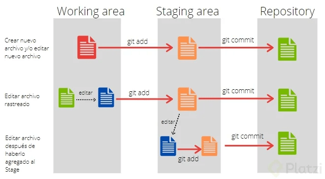
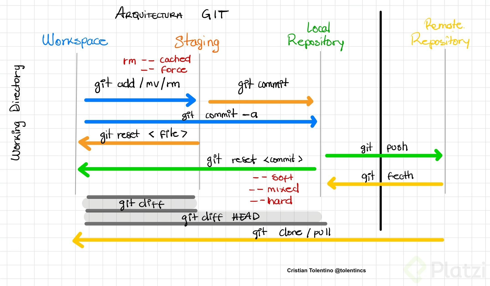

# Introducción a Git

## ¿Qué es Git?
Git es un sistema de control de versiones que permite llevar un registro de todos los cambios que se realizan en un repositorio.

## Ramas
Git maneja un sistema de ramificación, cada rama se denomina como 'branch' y normalmente al iniciar con git se crea la rama 'main', anteriormente llamada 'master', y se deja como la rama principal donde se insertarán los cambios de las otras ramas y de donde se puede crear nuevas ramas pero no hacer modificaciones en esta.

## CLI
Git funciona a través de comandos que se ingresan en una 'interfaz de línea de comandos', traducido del inglés 'Command Line Interface' abreviado como 'CLI' el cual maneja el intérprete de órdenes 'Bash'.

## Ciclo de trabajo
El ciclo de trabajo de git se le demonina "working directory", directorio de trabajo en español.
En este ciclo se conocen 2 fases:
- La primera fase se le conoce como "work area" o "workspace" que traducido es área de trabajo. Aqué se crean todos los nuevos archivos o tambien las modificaciones de los archivos existentes.
- La segunda es el "staging area" o también conocido como área de ensayo, que es donde se almacenan todos los cambios traidos del área de trabajo.

Luego de realizar todos los cambios deseados pasamos los repositorios, el primero es el repositorio local y el segundo es el repositorio remoto.
-  El repositorio local, que es donde se guarda definitivamente todos los cambios realizados en la máquina del usuario.
-  El repositorio remoto es donde se suben los archivos del repositorio local a un servicio en la nube como github, gitlab o bitbucket a través de internet.

A continuación se presenta un gráfico de ciclo de trabajo en git:


Y adicionalmente se presenta un gráfico de ciclo de trabajo de git en el repositorio local y mostrando las transacciones con el repositorio remoto:



## ¿Cómo iniciar el control de versiones?
Para iniciar a utilizar el sistema de control de versiones con el programa git se debe acceder a través de la consola o por la interfaz gráfica del sistema operativo a la carpeta o directorio donde se desee crear un nuevo repositorio y luego utilizar los comandos propios de este.

## Comandos de Git
Todos los comandos de git siempre inician con la palabra reservada 'git' para poder ejecutar las funcionalidades de este software.

**git init**: Para iniciar o reiniciar un repositorio.

```bash
# - Iniciando un nuevo repositorio.
$ git init
Initialized empty Git repository in C:/Documents/Project/.git/

# - Reiniciando un repositorio existente.
$ git init
Reinitialized existing Git repository in C:/Documents/Project/.git/
```

**git add**: Sirve para añadir un nuevo archivo o uno que haya sido modificado. El contenido agregado va al "staging area" o "área de ensayo".

```bash
# - Añadir un archivo específico.
$ git add <file>

# - Añade todos los archivos con la opción 'all' o con el símbolo del punto '.'.
$ git add .
```

**git status**: Sirve para ver el estado de la rama donde uno se ubica y puede mostrar la información de la siguiente manera:

```bash
# 1. Mensaje que muestra cuando no hay archivos en el area de trabajo
$ git status
On branch main
nothing to commit, working tree clean

# 2. Esto se muestra en la consola acerca del estado que muestra después de crean nuevos archivos en el area de trabajo los cuales no tienen seguimiento.
$ git status
On branch main
Untracked files:
  (use "git add <file>..." to include in what will be committed)
        "Nuevo Archivo WinRAR.rar"
        "Nuevo Documento de texto.txt"
        "Nuevo Microsoft Access Database.accdb"

nothing added to commit but untracked files present (use "git add" to track)

# 3. Añadimos archivos con 'git add .' y visualizamos el estado.
$ git add .
$ git status
On branch main

No commits yet

Changes to be committed:
  (use "git rm --cached <file>..." to unstage)
        new file:   Nuevo Archivo WinRAR.rar
        new file:   Nuevo Documento de texto.txt
        new file:   Nuevo Microsoft Access Database.accdb

# 4. Aqui visualuzamos los archivos modificados y algunas recomendaciones
$ git status
On branch main
Changes not staged for commit:
  (use "git add <file>..." to update what will be committed)
  (use "git restore <file>..." to discard changes in working directory)
        modified:   Nuevo Documento de texto.txt

# 5. Aqui visualizamos los archivos borrados y que pueden ser restaurados.
$ git status
On branch main
Changes to be committed:
  (use "git restore --staged <file>..." to unstage)
        deleted:    Nuevo Archivo WinRAR.rar
```

**git status -s**: El comando 'git status' con la opción '-s' muestra la informacion de forma abreviada.

```bash
# 1. No muestra nada y salta a la siguiente línea cuando no hay archivos en el area de trabajo.
$ git status -s
$

# Esto se muestra en la consola acerca del estado que muestra después de crean nuevos archivos en el area de trabajo los cuales no tienen seguimiento.
$ git status -s
?? "Nuevo hoja de texto.txt"

# 3. Añadimos con 'git add .' y visualizamos el estado
$ git add .
$ git status -s
A "Nuevo hoja de texto 2.txt"

# 4. Aqui visualuzamos las modificaciones
$ git status -s
M "Nuevo hoja de texto 2.txt"

# 5. Aqui visualizamos los archivos borrados y que pueden ser restaurados.
$ git status -s
D  "Nuevo Archivo WinRAR.rar"
```

**git commit**: Se utiliza después de agregar nuevos archivos o de realizar modificaciones en los archivos existentes y guardará todos los cambios hechos en el 'staging area' para que se queden en el repositorio local. Cada 'commit' debe tener un mensaje necesariamente.

```bash
# - Con la opción '-m' se puede añadir un mensaje en la misma línea sin necesidad de cambiar al editor de texto para añadirlo.
$ git commit -m "Adding files"
[main (root-commit) 1a5165f] Adding files
 3 files changed, 0 insertions(+), 0 deletions(-)
 create mode 100644 Nuevo Archivo WinRAR.rar
 create mode 100644 Nuevo Documento de texto.txt
 create mode 100644 Nuevo Microsoft Access Database.accdb
```

**git rm**: Este comando sirve para remover archivos y carpetas.

```bash
# - Con este comando se borra un archivo del repositorio.
$ git rm <file>

# - Usando la opción '-r' se borra el contenido de una carpeta o directorio del repositorio.
$ git rm -r <directory>

# - La opción '--cached' sirve para borrar un archivo o carpeta del repositorio pero manteniendolo en el "workspace"
$ git rm --cached <file>

# - Colocando la opción '-r' y el punto removemos todos los archivos dentro de una carpeta sin borrar esta.
$ git rm -r .
```

**git branch**: Permite mostrar, crear, modificar o eliminar ramas.

```bash
# - Muestra una lista de todas las ramas.
$ git branch

# - Crea una rama con un nombre específico.
$ git branch <branch_name>

# - Elimina una rama
$ git branch -d <branch_name>

# - Cambiar nombre de la rama
$ git branch <old_branch_name> <new_branch_name>
```

**git checkout**: Este comando tiene varias funcionalidades y se han creado otros comandos como **switch** y **restore** para separar la responsabilidad.

**git switch**: Sirve para cambiar entre las ramas existentes colocando el nombre de la rama a donde se desea ir.

```bash
$ git switch <other_branch_name>
```

**git merge**: Este comando sirve para fusionar la rama seleccionada con la rama en donde se ubique es ese momento el usuario.

```bash
$ git merge <other_branch_name>

# Ejemplo de una combinación con otra rama
$ git merge dev
Updating c9bb9be..d09fa4b
Fast-forward
 ...img/photo_1.jpg    | Bin 0 -> 192116 bytes
 ...img/text_file.txt  | Bin 92336 -> 0 bytes
 ...img/photo_2.jpg    | Bin 114969 -> 31420 bytes
 .../directory/file.md | 257 +++++++++++++++++----
 4 files changed, 215 insertions(+), 1 deletions(-)
 create mode 100644 img/photo_1.jpg
 delete mode 100644 text_file.txt
```

**git restore**: Con este comando podemos restablecer o descartan las modificaciones que se hayan realizado en el repositorio.

```bash
# - Se usa para descartan los cambios que se haya realizado en un archivo.
$ git restore <file>

# - Colocando el símbolo de punto '.' seleccionamos todos los archivos y se descartan sus cambios.
$ git restore .

# - Con la opción '--staged' se quita un archivo del "staging area".
$ git restore --staged <file>
```

**git reset**: Se utiliza para regresar un archivo del "staging area" o un "commit" del repositorio al "workspace".

**git log**: Muestra el registro de los commits con información detallada del autor, fecha y hora que se han realizado.

### Configuración de credenciales en el repositorio local
**git config**: Usando este comando se puede mostrar y modificar la configuración del repositorio y las opciones globales de git.

```bash
# - Muestra toda la lista de la configuracion de git.
$ git config --list

# - Ahora vamos a configurar las credenciales del usuario como el nombre y el correo.
$ git config user.name <name>

$ git config user.email <email>
```

### Comandos para conexión y manipulación con repositorio remoto

Existen servicios en la nube como github, gitlab y bitbucket para almacenar los archivos del repositorio local.

**git remote**: Permite crear, ver y eliminar conexiones remotas con otros repositorios.

```bash
# - Para crear una conexión se utilizan las opción "add origin".
$ git remote add origin [link https://server.com/name_user/name_project.git]

# - Para cambiar la url del repositorio en la nube hay 2 formas:

# 1. La forma sencilla es modificar directamente la URL:
$ git remote set-url origin [updated link https://server.com/name_user/name_project.git]

# 2. Alternativamente, la forma extensa es eliminar la URL actual y añadiendo la nueva:
$ git remote rm origin
$ git remote add origin [updated link https://server.com/name_user/name_project.git]
```

**git push**: Con este comando podemos subir nuestros cambios del repositorio local al repositorio remoto alojado en un servidor / en un servicio de la nube.

```bash
# Resultado en consola cuando no hay cambios para subir al servidor:
$ git push
Everything up-to-date

# Una muestra del resultado de la consola cuando usamos el comando 'git push'
$ git push
Enumerating objects: 53, done.
Counting objects: 100% (53/53), done.
Delta compression using up to 12 threads
Compressing objects: 100% (30/30), done.
Writing objects: 100% (31/31), 1.69 MiB | 1.03 MiB/s, done.
Total 31 (delta 2), reused 0 (delta 0), pack-reused 0
remote: Resolving deltas: 100% (2/2), completed with 2 local objects.
To [link url https://server.com/name_user/name_project.git]
   122eb43..e0d84e0  main -> main
```

**git pull**: Realiza la función inversa de "git push". Con este comando descargamos los cambios que se hayan subido al servidor en la rama correspondiente.

```bash
# Resultado en consola cuando no hay cambios para descargar del servidor:
$ git pull
Already up to date.

# Una muestra del resultado de la consola cuando usamos el comando 'git pull' y  hay cambios en el servidor.
$ git pull
remote: Enumerating objects: 140, done.
remote: Counting objects: 100% (140/140), done.
remote: Compressing objects: 100% (82/82), done.
remote: Total 106 (delta 24), reused 97 (delta 16), pack-reused 0
Receiving objects: 100% (106/106), 1.72 MiB | 217.00 KiB/s, done.
Resolving deltas: 100% (24/24), completed with 6 local objects.
From [link url https://server.com/name_user/name_project]
   87dc76a..38ae335  dev        -> origin/dev
   87dc76a..c44a5cf  main       -> origin/main
Updating 87dc76a..38ae335
Fast-forward
 .../pl/java/sintaxis/inicio.java                   |  12 -
 .../java/2_estrcuturas_datos.java                  |  91 ++++
 .../{main.java => abstract.java}                   |  96 ++--
 .../assets/imagen.jpg                              | Bin
 .../img/logo.png                                   | Bin 8907 -> 0 bytes
 .../imagenes/lista_lenguajes_SQL.jpg               | Bin 0 -> 192116 bytes
 81 files changed, 912 insertions(+), 1501 deletions(-)
 delete mode 100644 pl/java/sintaxis/inicio.java
 create mode 100644 pl/java/sintaxis/introduction.java
 rename pl/java/{main.java => abstract.java} (68%)
```

> Para ver mas sobre git podemos ir la documentación oficial en : [git-scm.com](https://git-scm.com)